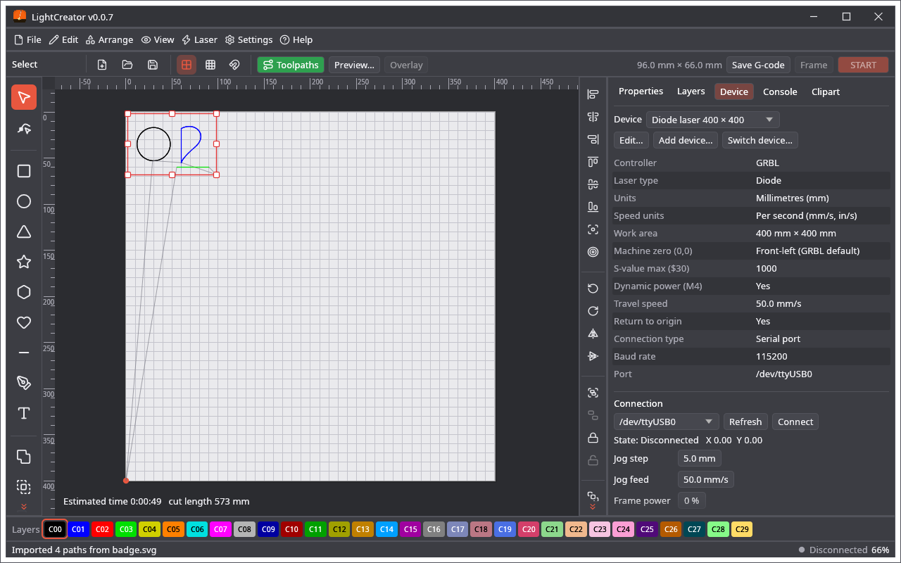
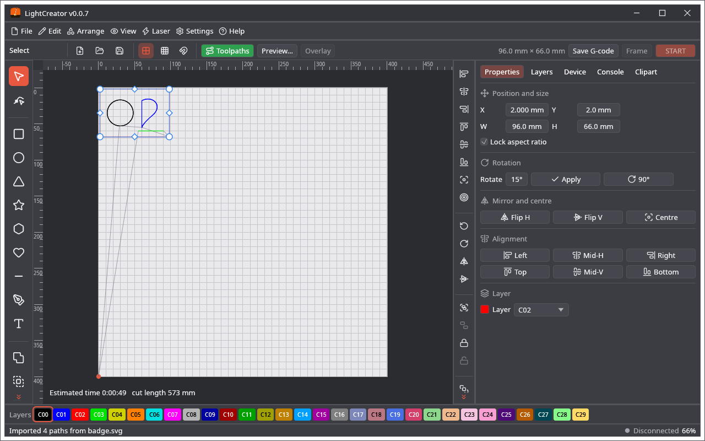

# Screenshots

All pictures are rendered headlessly from the real UI. Back to the [README](../README.md).

| | |
|---|---|
|  |  |
| Start window: pick the device to work with | Editor, Properties tab, toolpath preview on |
|  |  |
| Cuts / Layers tab | Console tab: live view of the serial traffic |
|  |  |
| Device configuration (controller, units, work area, port, jog) | Light colour scheme with the Polish interface |
|  |  |
| Bézier node editing with its floating toolbar | Text tool and text properties |
|  |  |
| Raster image engraving, dithered toolpath preview | Camera overlay aligned with four corners |
|  |  |
| Material library | Preview window: every burn operation in its own colour, with travel moves |
|  |  |
| Image import with rotate, flip, brightness, contrast and gamma | Trace an image into curves |
|  |  |
| Main and secondary grid options, layers in burn order | Triangle, star and polygon tools with the sides popup |
|  |  |
| Camera view docked as a side tab, rotated 90° | Sharing the laser's serial port with ser2net (Linux) |
|  |  |
| Layer names in the strip, layer options window, locked object, light work area in a dark scheme | Chinese interface, fonts and icons from the assets folder |
|  |  |
| Hindi interface | Built-in quick guide (F1) and the round corners window |
|  |  |
| Rounded rectangle and triangle | Clipart gallery: blue dots ship with the program, green dots are yours |
|  |  |
| Searching open icon collections and saving into a category | A gallery picture opened in the node tool |
|  |  |
| Device tab: settings in full width, jog arrows and controls as large equal buttons, STOP across the panel | Click a handle: the red resize selection turns blue, with round corner handles (rotate) and diamond edge handles (slant) |

Regenerate them with
`cargo test -p lightcreator --release render_screenshots -- --ignored`.
